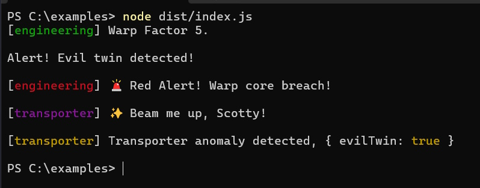

# missionlog  
[![NPM version][npm-image]][npm-url] [](https://coveralls.io/github/rmartone/missionlog?branch=master)

[npm-image]: https://img.shields.io/npm/v/missionlog.svg?style=flat  
[npm-url]: https://www.npmjs.com/package/missionlog  

🚀 **missionlog** is a **lightweight, structured logging package** designed for **performance, flexibility, and ease of use**. It works as a **drop-in replacement for `console.log` or `ts-log`**, and offers both **log level** filtering, optional **tag** filtering, and **customizable output handling**—all in a tiny (~1KB) package.  

✔ **Fully Typed (TypeScript)** • ✔ **ESM & CJS Support** • ✔ **Zero Dependencies** • ✔ **100% Coverage**   

---

## **✨ Why Use `missionlog`?**  

✅ **Drop-in Replacement for `console.log` & `ts-log`** – Start using it instantly!  
✅ **Seamless Upgrade to Tagged Logging** – Reduce log clutter and focus on what's important.  
✅ **Configurable Log Levels** – Adjust visibility for log level and tags at runtime.  
✅ **Customizable Output** – Send logs anywhere: console, JSON, cloud services.  
✅ **Blazing Fast Performance** – O(1) log level lookups for minimal overhead.  
✅ **TypeScript-First** – Full type safety, no need for `@types`.  
✅ **Works Everywhere** – Browser, Node.js, Firebase, AWS Lambda etc.  

---

## **📦 Installing**  
```sh  
npm i missionlog  
```

## 🎯 **Focus on What Matters, When It Matters**  
`missionlog` lets you **filter logs dynamically** by level or tag (optional) to avoid clutter and help you focus on what's important. 

## **🚀 Example**

```typescript
import { DEFAULT_TAG, log, LogLevel, LogLevelStr, tag } from "missionlog";
import chalk from "chalk";

// Uses the built-in **"Dummy"** logger and becomes a no-op
log.info(tag.engineering, "Engaging warp drive! Destination: The Final Frontier.");

// Assing tags levels, (TRACE < DEBUG < INFO < WARN < ERROR < OFF)
log.init({ Engineering: LogLevel.INFO, Transporter: LogLevel.DEBUG });

// Log with a tag
log.info(tag.Engineering, "Warp Factor 9!");

// Override the built-in **Dummy** logger with a custom behavior
log.init({ Engineering: LogLevel.INFO }, createLogHandler());

// Engineering's level is INFO+ so this gets logged!
log.info(tag.Engineering, "Warp Factor 5.");

// No tag so works like console and uses the default level
log.error("Alert! Evil twin detected!");

// Gets filtered since Engineering is INFO+
log.debug(tag.Engineering, "Warp Factor 9!");

// Update tag levels and override default (INFO)
log.init({
  Engineering: LogLevel.TRACE,
  [DEFAULT_TAG]: LogLevel.ERROR,
  Transporter: LogLevel.DEBUG,
});

// Log an error
const error = new Error("Warp core breach!");
log.error(tag.Engineering, "🚨 Red Alert!", error.message);

// Show some color!
log.debug(tag.Transporter, "✨ Beam me up, Scotty!");

// Log objects properly
log.warn(tag.Transporter, "Transporter anomaly detected,", { evilTwin: true });

// Replace dummy logger with custom behavior
function createLogHandler() {
  const logConfig: Record<
    LogLevelStr,
    { color: (text: string) => string; method: (...args: unknown[]) => void }
  > = {
    ERROR: { color: chalk.red, method: console.error },
    WARN: { color: chalk.yellow, method: console.warn },
    INFO: { color: chalk.green, method: console.log },
    DEBUG: { color: chalk.magenta, method: console.log },
    TRACE: { color: chalk.cyan, method: console.log },
    OFF: { color: () => '', method: () => {} }, // No-op
  };

  return (level: LogLevelStr, tag: string, message: unknown, params: unknown[]) => {
    const { method, color } = logConfig[level];  
    const logLine = `[${color(level)}] ${tag ? tag + ' - ' : ''}${message}`;
    method(logLine, ...params);
  };
}
```



---

## **📄 License**  
**MIT License**  
**© 2019-2025 Ray Martone**  

---

🚀 **Install `missionlog` today and make logging clean, structured, and powerful!**
